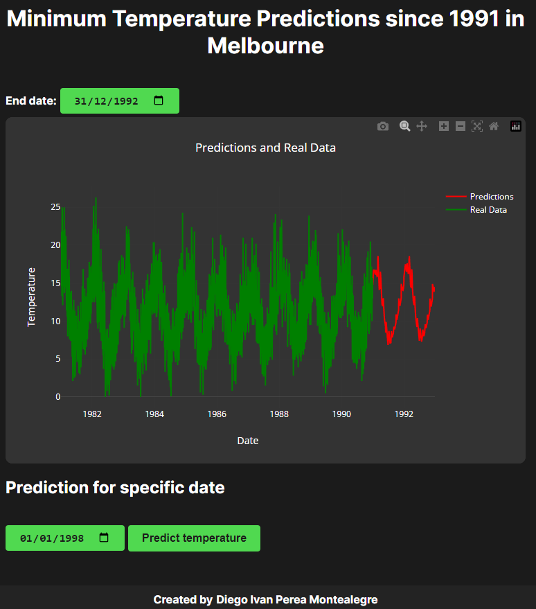
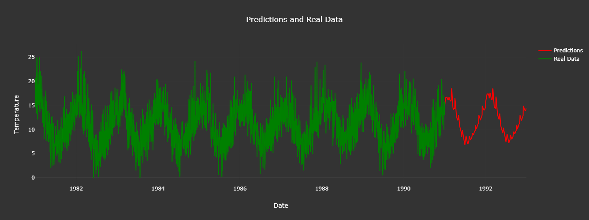

# Nextjs Minimum Temperature Predictions since 1991 in Melbourne

Nextjs Minimum Temperature Predictions since 1991 in Melbourne with dataset [Daily Minimum Temperatures in Melbourne](https://raw.githubusercontent.com/jbrownlee/Datasets/master/daily-min-temperatures.csv) 

Model used from [Modelos-de-Pronostico-de-Temperatura-Minima-en-Melbourne](https://github.com/diegoperea20/Modelos-de-Pronostico-de-Temperatura-Minima-en-Melbourne/tree/main/modeloMLP) for his size , but the code for the LSTM model was also added.

In "End date" , Select the date you want to predict the temperature and the red graph will predict it
<p align="center">
  
</p>

<p align="center">
  
</p>

Prediction for specific date
First Select the date you want to predict  With button "Preddic temperature" clicked ans show message 
"Predicted temperature for 1998-01-01: 14.32"


----
Convert h5 to Tensorflowjs in ipynb
```bash
!pip install tensorflowjs
```
```bash
!tensorflowjs_converter --input_format keras /root/to/your/model.h5 /root/to/your/folder/save
```
-----

-----

Install nextjs libraries tensorflow
```bash
npm install @tensorflow/tfjs @tensorflow/tfjs-backend-cpu @tensorflow/tfjs-backend-webgl
```
-----

Fronted Nextjs Options for do it:


This is a [Next.js](https://nextjs.org/) project bootstrapped with [`create-next-app`](https://github.com/vercel/next.js/tree/canary/packages/create-next-app).

## Getting Started
Nodejs version v20.10.0 and Next.js version v14.2.3 

First
```bash
npm install
```
run the development server:

```bash
npm run dev
# or
yarn dev
# or
pnpm dev
# or
bun dev
```

Open [http://localhost:3000](http://localhost:3000) with your browser to see the result.

## Resolve : Error Nextjs Parsing error: Cannot find module 'next/babel'

Put this code in .eslintrc.json 
```bash
{
  "extends": ["next/babel","next/core-web-vitals"]
}
```

Created by [Diego Ivan Perea Montealegre](https://github.com/diegoperea20)
